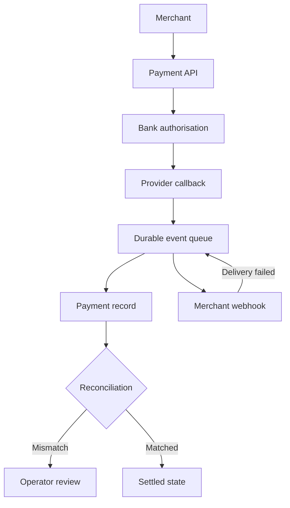

[← All systems](https://github.com/J0UH) · [Open finance and payments](https://github.com/J0UH/open-finance-payments)

  

# Direct bank payments for merchants

A customer can pay a merchant directly from a bank account in an online checkout, an app, or on dedicated hardware. That removes the card scheme and conventional gateway stack from the customer journey, while the merchant still gets a clear payment state, recovery, and reconciliation.

## The engineering problem

Direct bank payments still cross banks, merchants, customers, operators, and delayed events. The product has to feel consistent across ecommerce and physical checkout while preserving the evidence and controls expected in financial infrastructure.

## How it works

Inbound bank callbacks and outbound merchant webhooks are separate deployables joined by a durable queue. The callback side normalises a provider payload into a payment-status event; a separate worker owns merchant delivery, retry, and evidence.

## What the system covers

- Merchant and organisation onboarding
- Ecommerce, in-app, and hardware checkout
- Account-to-account payment initiation and bank authorisation
- Revocable credentials and environment separation
- Webhooks, transaction lookup, and reconciliation
- Admin and merchant operating surfaces
- Public integration documentation

## System shape

## Build notes

- Design states before screens. Every interface should explain the same payment lifecycle.
- Treat webhook recovery and idempotency as product behaviour, not backend trivia.
- Give operators enough evidence to resolve exceptions without reading application logs.

Public overview only. Source code, customer data, credentials, and private operating details are not included.

## Talk through a similar problem

Working on something similar? [Tell me about it](mailto:ju@jomena.group?subject=Direct%20bank%20payments%20for%20merchants).
