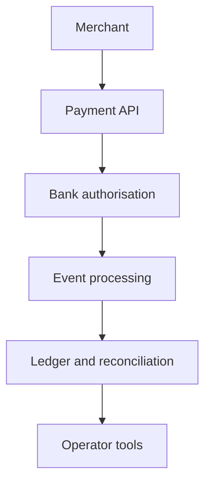

  

# Open finance platform

A payment is easy to draw as one arrow. A usable payment product is the system around that arrow: merchant setup, credentials, consent, bank handoff, asynchronous status, settlement records, webhooks, reconciliation, and the tools people need when the happy path breaks.

[Discuss a similar system](mailto:ju@jomena.group?subject=Discuss%20Open%20finance%20platform) | [Book a technical call](mailto:ju@jomena.group?subject=Book%20a%20technical%20call%20about%20Open%20finance%20platform)

## The engineering problem

The hard part was keeping one understandable state across banks, merchants, customers, operators, and delayed events. The product had to be simple enough to integrate while preserving the evidence and controls expected in financial infrastructure.

## What the system covers

- Merchant and organisation onboarding
- Payment initiation and bank authorisation
- Revocable credentials and environment separation
- Webhooks, transaction lookup, and reconciliation
- Admin and merchant operating surfaces
- Public integration documentation

## System shape

## Build notes

- Design states before screens. Every interface should explain the same payment lifecycle.
- Treat webhook recovery and idempotency as product behaviour, not backend trivia.
- Give operators enough evidence to resolve exceptions without reading application logs.

Built under the Aryze umbrella. The underlying source and company IP remain private and owned by Aryze. Delivery involved people across engineering, product, operations, compliance, and design. Open-source foundations retain their original attribution and licences.

## Talk through a similar problem

If you are trying to build, untangle, or ship a system in this area, [send me a note](mailto:ju@jomena.group?subject=I%20need%20help%20with%20Open%20finance%20platform). If the problem needs a deeper technical conversation, [book a call by email](mailto:ju@jomena.group?subject=Book%20a%20technical%20call%20about%20Open%20finance%20platform).
